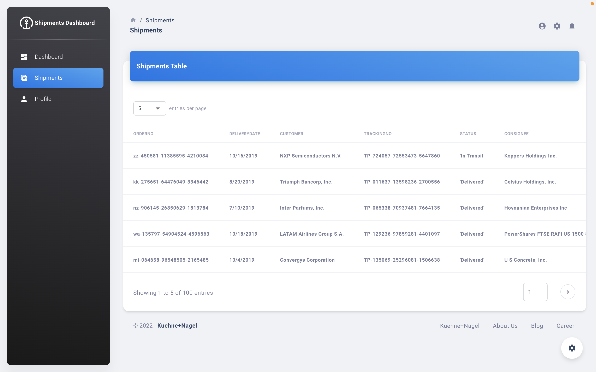

# Shipment Dashboard App

This project was created for the Kuehne + Nagel Frontend Developer Internship assignment.

Shipments data are displayed in a table. With the button on the table opens to a panel showing the shipment detail in a single row. The values could be changed in the UI.

To see the project in action, go to [Shipment Dashboard](https://ozgeyaylagul-shipment-dashboard.netlify.app). 



## Technologies used:

* JavaScript
* CSS
* Material UI
* React.js
* React Router - v6
* Axios
* ESLint and Prettier

## Getting Started

Clone this repo : `git clone https://github.com/ozgeyaylagul/shipment-dashboard-app.git`

Navigate to the root folder and install all dependencies :

* `yarn install` or `npm install`

Start Development Mode :

* `yarn start` or `npm start`
* Open http://localhost:3000 to view it in the browser.

## What's included

Within the clone you'll find the following directories and files:

```
shipment-dashboard-app
    ├── public
    │   ├── apple-icon.png
    │   ├── favicon.png
    │   ├── index.html
    │   ├── manifest.json
    │   └── robots.txt
    |   └── shipments.txt
    ├── src
    │   ├── assets
    │   │   ├── images
    │   │   └── theme
    │   │       ├── base
    │   │       ├── components
    │   │       ├── functions
    │   │       └── index.js
    │   │   └── theme-dark
    │   │       ├── base
    │   │       ├── components
    │   │       ├── functions
    │   │       └── index.js
    │   ├── components
    │   │   ├── MDAlert
    │   │   ├── MDAvatar
    │   │   ├── MDBadge
    │   │   ├── MDBox
    │   │   ├── MDButton
    │   │   ├── MDInput
    │   │   ├── MDPagination
    │   │   ├── MDProgress
    │   │   ├── MDSnackbar
    │   │   └── MDTypography
    │   ├── context
    │   ├── examples
    │   │   ├── Breadcrumbs
    │   │   ├── Cards
    │   │   ├── Charts
    │   │   ├── Configurator
    │   │   ├── Footer
    │   │   ├── Items
    │   │   ├── LayoutContainers
    │   │   ├── Lists
    │   │   ├── Navbars
    │   │   ├── Sidenav
    │   │   ├── Tables
    │   │   └── Timeline
    │   ├── layouts
    │   │   ├── dashboard
    │   │   ├── detailPanel
    │   │   ├── profile
    │   │   └── shipments
    │   ├── App.js
    │   ├── index.js
    │   └── routes.js
    ├── .eslintrc.json
    ├── .prettierrc.json
    ├── CHANGELOG.md
    ├── ISSUE_TEMPLATE.md
    ├── jsconfig.json
    ├── LICENSE.md
    ├── package.json
    └── README.md
```


## Credit

This project was developed using [Material Dashboard 2 React](https://www.creative-tim.com/product/material-dashboard-react). @ 2022 | Copyright [Creative Tim](https://www.creative-tim.com/templates/free)